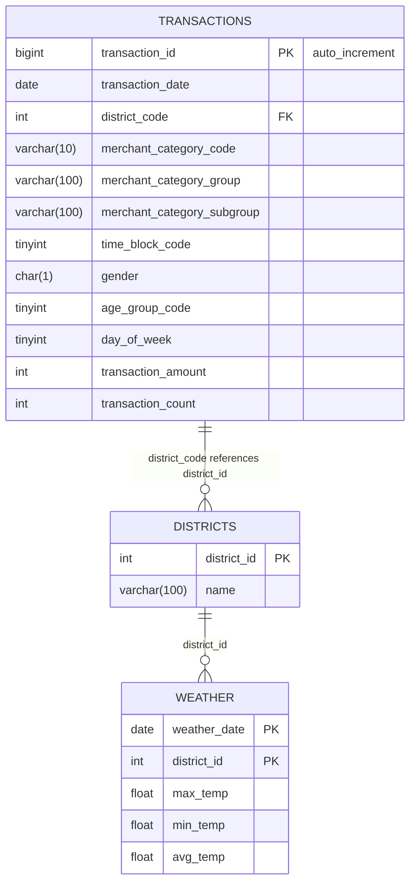

- `trans_date`: 거래 날짜 (ta_ymd)
- `district_id`: 행정구역 번호 (admi_cty_no)
- `merchant_category_code`: 카드 업종 코드 (card_tpbuz_cd)
- `merchant_category_group`: 카드 업종명 1차 (card_tpbuz_nm_1)
- `merchant_category_subgroup`: 카드 업종명 2차 (card_tpbuz_nm_2)
- `hour`: 시간대 (1~10)
- `sex`: 성별 (F 또는 M)
- `age_group`: 연령대 (예: 7=70대)
- `day_of_week`: 요일 (1: 월요일 - 7: 일요일)
- `amount`: 거래 금액 (amt)
- `count`: 거래 건수 (cnt)

### district_id
- 41111 장안구
- 41113 권선구
- 41115 팔달구
- 41117 영통구
